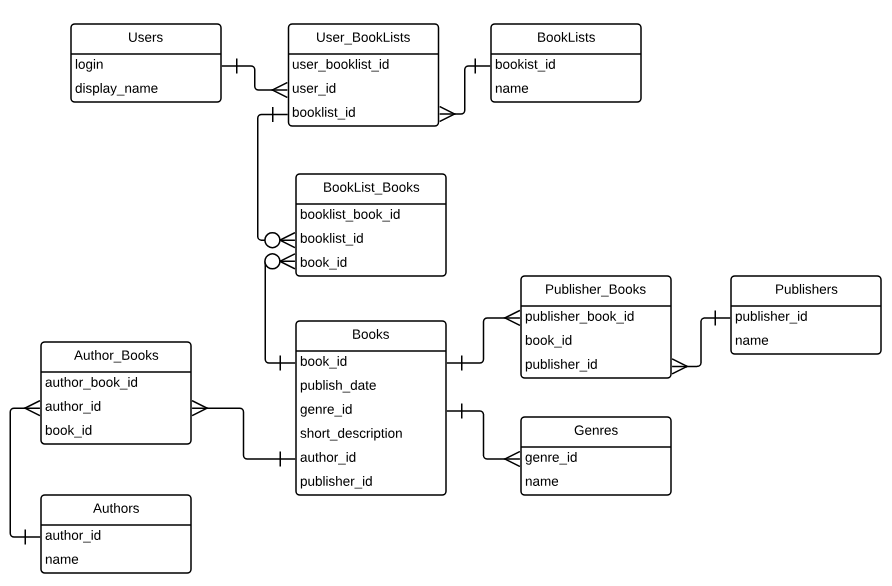
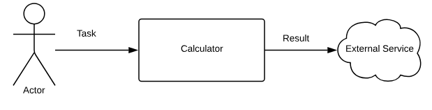
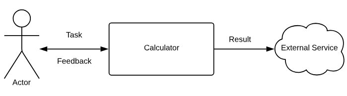
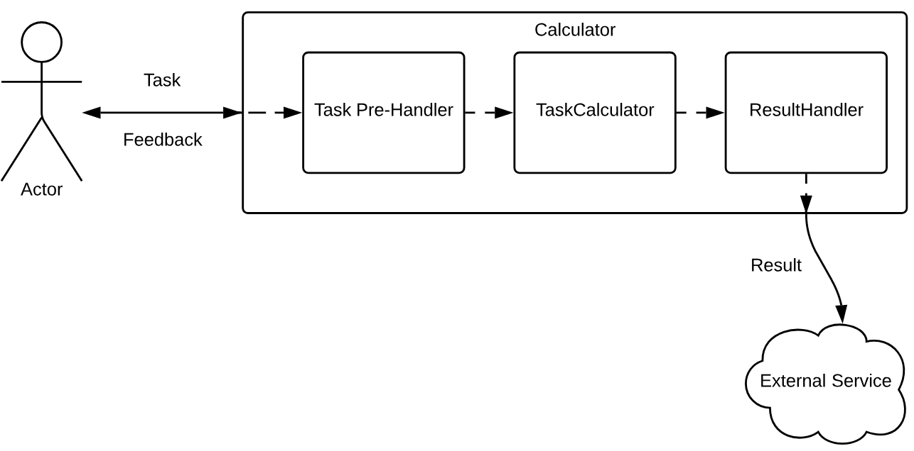
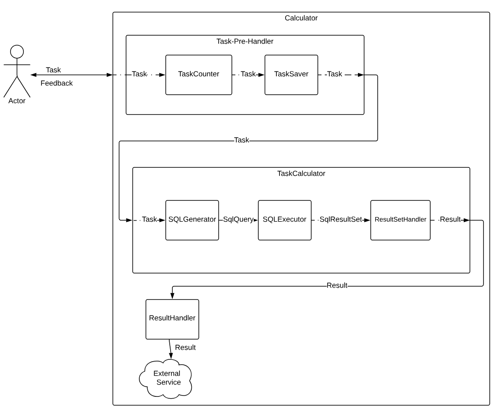

# Архитектура на практике

## Введение

Перед прочтением данной главы, ознакомьтесь с [главой про архитектуру](archicture.md), а также c
[Пошаговым гайдом о разработке интерфейсов](interface.md).

Здесь же мы разберем на практике принципы и приемы по построению грамотного дизайна на примере нескольких систем.

Так как данная книга по спрингу, то и реализации у нас тоже будут на спринге. Но мы постараемся также рассмотреть 
и аналоги (но не Java EE, от которой отказались даже родители)

## Структура данных первична или замолвите слово о Реляционной модели

### Описание задачи

Рассмотрим такую задачу:

Необходимо реализовать сервис для обмена списками книг. У пользователя может быть несколько списков книг (по аналогии с 
плейлистома с музыкальными трэками). Пользователь может просматривать имеющиеся книги в базе сервиса 
и добавлять их в свои списки.
Книги можно сортировать по автору, жанру. Фильтровать по автору, жанру, названию, жанру.
При просмотре книги выводится автор, издательство, год издания, жанр,
краткое описание. 

У пользователя есть список друзей, которым он может рекомендовать свои буклисты (списки книг).

### Анализ задачи 

Перед любым проектированием надо пересилить себя и устроить небольшой мозговой штурм перед тем, как начать писать код.
Потому что правило "Семь раз отмерь, один раз отрежь" никто не отменял. Если вы сначала все обдумаете, то это,
во-первых, сильно сэкономит вам время, во-вторых, реализовать будет проще, так как понятно, что делать, и в-третьих,
у вас будет какая-никая документации к проекту.

Перейдем непосредственно к анализу.

#### Выделение требований

Самый важный факт. По идеи, это работа системного аналитика, а не программиста, но кого это волнует, правда? Будем 
рассчитывать только на себя. 

Для начала формализуем явные требования. Явные требования это то, что просят сделать, а неявные -- что подразумевают.
Явные требования описывать легче всего, поэтому приступаем:

* У пользователя должна быть возможность посмотреть имеющиеся книги. То есть должна быть реализована
страница со списком книг, где каждая книга имеет определенные характеристики. 
* Список книг можно сортировать и фильтровать.
* Пользователь может создавать буклисты и иметь возможность добавлять туда книги.
* У пользователя могут быть от 0 до N друзей.
* Пользователь может предлагать друзьям свои буклисты в качестве рекомендаций.

Теперь неявные требования. Неявные требования опираются на явные, но с добавлением здравого смысла.
Например:

* Раз у пользователя есть список друзей, значит должен быть механизм добавления другого пользователя в друзья.
* Глупо рекомендовать друзьям пустой буклист, поэтому это ситуацию будем считать недопустимой. 
* Нельзя создавать буклисты с пустым именем, либо выглядищим таковым. Казалось бы, капитан очевидность, но по законам
Мерфи, если можно что-либо сделать, то это будет сделано.
* Буклист должен содержать только уникальные книги. Зачем нам в рекомендациях буклиста с 10 экземлярами 
"50 оттенков серого", правильно?

И так, пока у вас есть силы и фантазия. 

Когда вы создали проект, в корне проекта у вас должен быть файл `README.md` (если нет, то самое время его создать).
В этом файле и зафиксируйте все требования, явные и неявные. 

Переходим к следующему этапу, одному из самых сложных и ответственных при проектировании подобных систем. 

#### Проектирование реляционной модели

Уже из описания задачи видно как много времени уделено описание взаимосвязям между сущностями. 

Для дизайна системы важно правильно спроектировать реляционную модель (какие сущности есть и как они между собой 
взаимосвязаны).

Рекомендую взять блокнотик и рисовать. Выделим из описания задачи основные сущности:

* **Пользователь** -- пользователь сервиса. 
* **Книга** -- книга
* **Буклист** -- список книг

Добавим взаимосвязи между сущностями:

* У **Пользователя** может быть *много* **Буклистов**. Так как буклисты можно шарить между друзьями, а друзьями будут
являться другие пользователи, то логично, если у **Буклиста** будет *много* **Пользователей**. Значит связь **Много-ко-
многим**. 
* У **Буклиста** может быть *много* **Книг**, а **Книга** может входить в *несколько* разных **Буклистов**. Связь
**Много-ко-многим**.
* У **Пользователя** может быть много друзей, а друзьями выступают другие **Пользователи**, значит связь
опять **Много-ко-многим**.
* У **Книги** может быть несколько **Авторов**, а у **Автора** может быть несколько книг. Значит добавляется сущность
**Автор** со связью **Много-ко-многим**. Так же и с **Жанром**, но будем считать, что связь книги и жанра относятся
как **Много-к-одному**. И **Изадетельство**, как **Много-ко-многим**.

С основными сущностями определились, далее продумаем их аттрибуты. Как проектировать аттрибут?

1. Придумать какое свойство сущности он будет отображать. Например, у сущности работник аттрибут *Имя*. 
2. Продумать тип аттрибута, его длину. Если это *Имя*, то хватит строки (`varchar(20)`), если возвраст, то целое число 
(`int`).
3. Определить, может ли аттрибут отсутствовать (nullable). Например, *Имя* работника должно быть заполнено обязательно,
а *Хобби* отсутствовать (например, как у меня).
4. Продумать ограничения аттрибута (constraint). Поле может быть иметь уникальные значения (ключ доступа), 
не может быть меньше 0 (зарплата), может иметь значение по умолчанию. 

Используем полученные знания на практике:

* **Пользователь**:
    * Для входа в сервис у каждого пользователя должно быть уникальное имя, а значит нужен аттрибут *Логин*. Логин 
    будет первичным ключом, не может быть nullable. Тип строковый.
    * Логин часто бывает некрасивым и на латинице, поэтому добавим аттрибут *Отображаемое имя*. Например, Алексей.
    Алексеев в сервисе может быть много, поэтому этот аттрибут не может быть уникальным. Но будем считать, что у 
    каждого пользователя должно быть красивое имя (ник), и поэтому поле сделать `not null`.
    * Ссылка на сводную таблицу друзей. У пользователя может не быть друзей, например, сразу после регистрации, поэтому 
    поле может быть `nullable`. 
    * Ссылка на сводную таблицу буклистов. У пользователя может не быть буклистов, например, после сразу после
    регистрации, поэтому аттрибут может быть `nullable`.
* **Буклист**:
    * Уникальный идентификатор
    * Название (например, "Любимая фантастика 80-х")
    * Буклист характирузуется набором книг
* **Книга** (берем из требований):
    * *Ссылка на автора*. Обязательный аттрибут
    * *Издательство*. Обязательный аттрибут
    * *Год издания*. Обязательный аттрибут
    * *Жанр*. Обязательный аттрибут
    * *Краткое описание*. Обязательный аттрибут. 
 * **Автор**:
    * Уникальный идентификатор
    * Имя 
* **Издательство**
    * Уникальный идентификатор
    * Название 
* **Жанр**
    * Уникальный идентификатор
    * Название                        

В итоге получаем следующую ER-диаграмму:

 

Либо же диаграмма сущностей для СУБД:




#### Реализация реляционной модели 

Есть два подхода воплощения созданной ER-диаграммы в жизнь:

* **СУБД-first**. Пишем sql (ddl) скрипт для создания таблиц, ограничений, ключей для базы данных. На основе созданной
схемы бд генерируем Java классы (entity).
    * Плюсы:
        * Больше работаем с sql, с субд. Практика не помешает, тем более есть вещи, которые можно сделать только через
        sql.
        * Некоторые возможности (например, check'и, дополнительные проверки для 
        целостности) нагляднее писать в sql скриптах, чем захламлять Java модели.
    * Минусы:
        * Надо руками создавать таблицы для Many-to-Many.
        * Надо писать свой скрипт под каждый диалект СУБД             

* **Java-Class-first**. Пишем Java класс (entity), на основе их генерируется схема в бд. 
    * Плюсы:
        * В большинстве случаев это гораздо удобнее, чем писать каждый раз sql скрипт. Фишка в том, что модели все равно
        писать надо и схема по ним создаваться может, и тогда непонятно, зачем еще большой sql скрипт писать. 
    * Минусы:
        * Если много разных contraint'ов, индексов и дополнительных штук-дрюк, то модели начинают выглядеть просто 
        ужасно и мало понятно.  

Как совет, в простых приложениях используйте первый способ. Когда сможете писать sql скрипты без подглядываний, тогда 
можете начинать со второго способа. Не ленитесь, знание sql это важный навык.

#### Анализ бизнес-логики

Правильная реляционная модель это уже половина работы по реализации бизнес-логики приложении. 

Теперь надо из задачи выделить моделируемые бизнес-процессы. Здесь нам очень помогут требования, которые мы выделили 
[выше](a1.md#_6). 
Давайте я выделю пару процессов на примере нашей задаче,
чтобы было нагляденей.

* Создание буклиста

    1. Пользователь посылает команду в приложение для создания буклиста. Команда содержит имя буклиста. Опционально,
    команда может содержать **множество** (множество в отличие от списка хранит только уникальные значения)
     id книг, которые добавляются в буклист. Приложение должно вернуть уникальный
    идентификатор созданной сущности (буклиста в данном случае), либо описание ошибки. 
    
    ??? tip "Совет"
        Вспомним понятие **CRUD**. В данном случае мы выполняем операцию **CREATE**. В качестве ответа на эту команду
        хорошей практикой является возвращание сгенерированного id сохранненой сущности, либо сохранненую сущность 
        целиком. Это необходимо для отрисовки фронт-енда.

* Добавление книги в существующий буклист
    1. Пользователь посылает команду в приложение добавлении книгу в буклист. Команда содержит идентификатор буклиста,
    множество идентификаторов добавляемых книг. Приложение возвращает обновленный буклист, либо описание ошибки.

* Добавление друга
    1. Пользователь посылает команду в приложение на добавление друга. Команда содержит логин добавляемого пользователя.
    Возвращаем добавленного друга, либо ошибку.

* Рекомендация буклиста другу
    1. Пользователь посылает команду в приложение для рекомендации своего буклиста. Команда содержит id буклиста,
    логин друга. По сути это сделать легко, надо просто добавить в таблицу связи между пользователем и буклистом новую 
    запись. Сложность в том, что надо прислать на фронт енде уведомление другу, что ему порекомендовали книгу. Этот 
    момент надо продумать.

Если посмотреть на придуманные бизнес-процессы, то можно заметить, что их, во-первых, немного, а во-вторых, они довольно
простые и укладываются в CRUD. Да-да, это вам не приложения со сложным кодом.     
                 
#### Резюме

А где практика??? Такой вопрос с большой долей вероятностью возник у вас в голове. Реализацию подобного приложения 
на Spring'e мы рассмотрим в другой части книги, так как это довольно объемно. Но некоторые важные выводы сделать 
следует.       
 
Проблема архитектур таких систем заключается в размытии бизнес-логики по всем частям приложения: объектах
в бд, бизнес-логике на бэкенде, во фронт-енде (та же валидация, UX, который влияет на структуру запросов, приходящих
на сервер). Из такой размазанности нельзя собрать всю логику в одном месте, что очень сильно увеличивает сложность 
системы. Более того, эту сложность никак не уменьшить. 

Ок, можно разбить приложение на микросервисы и создается 
иллюзия, что система стала проще, так как часть функционала лежит в одном месте, в микросервисе. Только не зря я сказал
про иллюзию. Микросервисы не упрощают систему, как асинхронность не увеличивает производительность (а только у меньшает
задержки), а, наоборот, усложняют ее еще сильнее. Микросервисы нужны для решения совсем других проблем.

В таких системах даже декомпозицию толком не сделаешь, поэтому многие на нее забивают и кидают всю логику в 
`UserService`, а то и часть логики и вовсе хранят в контроллерах. 

Другая проблема, которая вносит в хаос. Часто бизнес так меняет требования, что приходится менять сигнатуры интерфейсов.
А это очень больно, особенно, если интерфейс много где используется. На практике, конечно, меняются интерфейсы сервисов
с бизнес-логикой, которые используются в основном на одном контроллере. Но ситуация все равно не самая приятная.

Некоторые принципы, например, принцип **Открытости-Закрытости** здесь почти не работают, так как изменения
очень часто незначительны, и многие меняют уже готовый код. Да, так делать нельзя и все такое, но это жизнь, пацан. 
И с этим надо считаться. Конечно, можно приложить усилия и задекомпозировать любой бизнес-модуль так, что действительно
можно заменить пару реализаций и все будет ок, но чаще всего проще внести небольшое изменение. 
 
И самое главное. 

**Некому не нужна твоя красивая архитектура**. Бизнесу важно добавить вот эту мааааленькую фичу вчера. Потратил
2 дня написание unit тестов? Ты с ума сошел, чем у вас разработчики занимаются, ко-ко-ко, а как же фичи, ко-ко-ко.

Какие пути решения озвученных проблем есть?

Во-первых, на любую бизнес-логику нужен unit тест. Его написание занимает больше времени, чем написать сам класс,
это дополнительные издержки на его поддержку. Но грамотный unit тест окупит любые издержки, так как он позволяет
быстро локализовать деградацию кода (ошибки, вызванные изменениями в коде).

Во-вторых, подробное описание, чего только можно. Бизнес-процессов, документация над методами, над классами. 

В-третьих, соблюдать все принципы архитектур по возможности. Для каждого бизнес процесса иметь интерфейс. Всю логику
держать в сервисах, даже если она дублирует методы Data Access слоя. Так как требования могут измениться, а у вас 
весь клиентский код ссылается на Data Access и туда уже хрен вклинишься.  

В-четвертых, почитать про паттерн [Адаптер](https://refactoring.guru/ru/design-patterns/adapter). Он позволяет работать
с легаси, либо deprecated интерфейсами. Идея написать новый интерфейс, а к нему реализацию-адаптер, который будет
делегировать логику старому интерфейсу. А затем написать новую реализацию и убрать легаси.

В-пятых, не ленится писать тесты и документацию, чтобы дальнейшая работа на проекте не превратилась в ад, когда для 
добавление самой простой фичи будет занимать недели две.

В-шестых, выносить инфраструктурные компоненты как отдельные сервисы. Например, отправка почты, уведомлений. Все
что может работать независимо, следует вынести как отдельный сервис, чтобы не раздувать кодовую базу. 

В-седьмых, **убедить бизнес, тимлида в необходимости затрат на написание тестов и документации**. Да, есть срочные вещи,
которые накапливают технический долг (то есть все мероприятия, которые должны были быть сделаны, но отложены на потом).
Но тогда надо выделять время в следующих спринтах для уменьшиения этого долга, и, желательно не тянуть, иначе
уже забудете, что написали. Если убедить не получилось, то увольняйтесь. Серьезно, там ловить нечего, только будете
деградировать и потом будете блужать по всяким говно-конторам, где все те же яйца, только сбоку.

И тут уже работа программиста выглядит не такой веселой, да? Добро пожаловать на галеру, пацан.

## Логика обработки первична

Рассмотрим такую задачу:

Есть большой объем данных по продажам мобильных устройств в Китае, который хранится  в колоночкой базе данных 
с поддержкой SQL`92. Нашим клиентам хотелось бы получать различные статистики по продажам, например, количество
проданных телефонов определенной марки (например, Huawei) или отношение проданных телефонов с вырезом на экране 
к телефонам без выреза в %. 

Требования: 

* Система принимает на вход задание через Web API, 
в которой описано, что необходимо посчитать, за какой период и URL, на 
который необходимо отправить результат расчета

* Задания должны быть привязаны к пользователю, которые их отправил, 
и храниться в каком-либо хранилище

* После расчета на указанный в задаче URL должен быть отправлен результат задания

Данные лежат преимущественно для чтения, логика их обработки важнее, чем сама структура данных. 

Поэтому проектирования начинаем с описания логики обработки. 

Важной особенностью таких систем состоит в том, что источник данных (например, юзер, посылающий запрос на веб-сервер)
не является потребителем конечных данных (например, в конце обработки мы записываем их в базу или отправляем на внешний
сервис). 
    
### Декомпозиция

Первым шагом при решении любой задачи является декомпозиция: разбиение большой задачи на задачи поменьше. 

#### Модули первого уровня

Начнем с [иерархической декомпозиции](archicture.md#_5).

Наша система должен считать задания и отправлять результаты на URL, указанный в задании. Давайте порисуем в блокнотике:



Так как мы принимаем запрос по http, а этот протокол подразумевает получение ответа на каждый запрос, 
то нам пользователю необходимо отдать какой-либо ответ, например, задача принята на расчет или произошла ошибка.
Поэтому немного модернизируем нашу схему:



#### Модули второго уровня

Далее разобьем большой модуль *Calculator* на несколько модулей (задач) поменьше.  

Для этого применим [функциональную декомпозицию](archicture.md#_6). 

Давайте определим независисые друг от друга задачи, которые должна выполнять система, исходя из требований:

* Система должна хранить задания с привязкой к пользователю. 

* Система должна рассчитывать задания

* Система должна отправлять результат задания на внешний сервис

Каждой задаче будет соответствовать свой модуль. Нарисуем новую схему: 



Каждую такую задачу мы выделяем в отдельный модуль. В итоге, мы получаем следующие функциональные модули:

* Модуль пред-обработки заданий (сохранение) (**Task Pre-Handler**)

* Модуль расчета заданий (**TaskCalculator**)

* Модуль обработки результата задания (**ResultHandler**)

А вот дальше уже проблема. Если три модуля выше были очевидны из требований, то как разбивать дальше уже плохо 
понятно. В таком случае, что мы говорим дальнейшей декомпозиции? Не сегодня. И переходим к практике. 

???+ tip "Совет"
    Если при декомпозиции вы не можете разбить задачу на более мелкие, оставьте ее единым целом. При написании 
    реализации появится ясность, как разбивать дальше.

Каждому модулю должен соответствовать интерфейс с описание входных и возвращаемых данных, ограничений, описания 
возвращаемых значений, исключений и так далее. 

Модуль *Calculator* состоит из нескольких модулей поменьше. Вопрос в том, делать ли для него интерфейс? Да, так как
это полноценный модуль, с входными-выходными данными. Это и есть паттерн [Фасад](archicture.md#_8).  

Приступим к написанию интерфейса. Для этого вспомним нашу схему:


Как видно из схемы, мы принимаем Task, возвращаем Feedback. Связь с внешним сервисом у нас будет инкапсулирована
внутри нашего модуль *Calculator*. Немного кода:

```java
import org.springframework.lang.NonNull;

/**
* Калькулятор заданий в целом. Принимает задание на расчет 
* и отдает обратную связь (сообщение)
*/
public interface TaskCalculatorFacade {
    
    @NonNull Feedback calculate(@NonNull Task task);
}
```

Это будет главный интерфейс для доступа к нашей системе (не забываем, что это называется [Фасад](archicture.md#_8)). 

Теперь опустимся на уровень ниже и напишем интерфейсы для модулей поменьше, согласно нашей схеме:


 

Получаем:

```java
import org.springframework.lang.NonNull;

/**
* Модуль пред-обработки заданий (сохранение)
* 
*/
@FunctionalInterface // контроллирует, что интерфейс имеет только один недефолтный метод. 
// Это небходимо, чтобы мы могли писать реализации интерфейсы в виде лямбды 
public interface TaskPreHandler {
    
    /**
    * Обработывает задание. Способ обработки зависит от реализации. 
    * 
    * {@link Task} - модель представления задания   
    * 
    * @param task задание. 
    * @return контейнер для задания. Необходим, если вместо с задачей 
    * надо передать дополнительную информацию
    * @throws TaskHandleException ошибка при обработке
    */
    @NonNull
    Task handle(@NonNull Task task) throws TaskHandleException; 
}
```

```java
import org.springframework.lang.NonNull;

/**
* Модуль расчета заданий
*/
@FunctionalInterface 
public interface TaskCalculator {
    
    /**
    * Расчитывает задание
    * @param task задание
    * @return результат задания
    * @throws CalculateException ошибка при расчете задания
    */
    @NonNull
    Result calculate(@NonNull Task task) throws CalculateException; 
}
```      
    
```java
import org.springframework.lang.NonNull;

/**
* Модуль обработки результата задания
*/
@FunctionalInterface 
public interface ResultHandler {
    
    /**
    * Обрабатывает результат расчета задания
    * @param result результат расчета
    * @throws ResultHandleException ошибка при обработке результата
    */
    void handle(@NonNull Result result) throws ResultHandleException;
    
}
```    
    
???+ danger "Важно"
    При проектировании системы, как может заметить внимательный читатель, мы не обращали внимание
    на структуру обрабатываемых данных. В интерфейсах выше пока стоят модели (Data Transfer Object или DTO) без какой-либо
    структуры, так как структура данных не играет роли. Структура данных влиет прежде всего на реализации. 
    
Напишем для примера реализацию `TaskPreHandler` с использованием **Data Access Layer**:

```java
@Service
public class TaskSaver implements TaskPreHandler {
    
    // это интерфейс из Data Access Layer
    private final TaskRepository taskRepository;
    
    public TaskSaver(TaskRepository taskRepository) {
        this.taskRepository = Objects.requireNonNull(taskRepository);
    }
    
    @NonNull
    public Task handle(@NonNull Task task) throws TaskHandleException {
        try {
            return taskRepository.save(task);
        } catch (PersistenceException ex) {
            throw new TaskHandleException(ex);
        }
    }
}
```    
   
После декомпозиции большого модуля, мы можем написать реализацию для его интерфейса. которая объединит через композицию
модули поменьше:

```java
public class TaskCalculatorFacadeImpl implements TaskCalculatorFacade {

    private final TaskPreHandler taskPreHandler;

    private final TaskCalculator taskCalculator;

    private final ResultHandler resultHandler;

    public TaskCalculatorFacadeImpl(
            TaskPreHandler taskPreHandler,
            TaskCalculator taskCalculator,
            ResultHandler resultHandler
    ) {
        this.taskPreHandler = Objects.requireNonNull(taskPreHandler);
        this.taskCalculator = Objects.requireNonNull(taskCalculator);
        this.resultHandler =  Objects.requireNonNull(resultHandler);
    }

    public Feedback calculate(Task task) {
        try {

            Task handledTask = taskPreHandler.handle(task);
            Result result = taskCalculator.calculate(handledTask);
            resultHandler.handle(result);
            return Feedback.success();
        } catch (CalculateException | TaskHandleException | ResultHandleException e) {
            return Feedback.error(e);
        }
    }
}
```

Далее пишем реализации для оставшихся интерфейсов. 
 
#### Модули третьего уровня 
 
В качестве примера дальнейшей декомпозиции возьмем `TaskCalculator`. И идем известным путем. У нас есть большая 
задача (расчет заданий), которую надо разбить на несколько маленьких. Начинаем снова рассуждать. 

Данные по продажам лежат в базе с поддержкой SQL. Значит получать выборку для расчета или уже готовые значения
мы можем через SQL. 

Попытаемся разобраться, что нам будет необходимо для реализации калькулятора:

* SQL Query Generator. Модуль, который будет генерировать sql запрос на основе задания (`Task`)
* SQL Executor. Модуль, который будет выполнять sql запрос и возвращать нам какие-то данные (либо выборку, либо 
рассчитанные значения).   
* SQL ResultSet Handler. Модуль обработки результа запроса

Продолжаем рисовать и дополняем нашу схему:



Набросаем интерфейсы:

```java
/**
* Модуль, который будет генерировать sql запрос на основе задания (`Task`)
*/
@FunctionalInterface
public interface SqlQueryGenerator {
    
    /**
    * Генерирует sql запрос для задания
    * @param task задание
    * @return sql запрос
    * @throws QueryGenerateException если для задания невозможно сгенерировать валидный sql запрос
    */
    @NonNull
    String generate(@NonNull Task task) throws QueryGenerateException;
} 
```

Для простоты интерфейсы остальных модулей опустим.

Пишем реализацию для `TaskCalculator`:

```java
public class SqlTaskCalculator implements TaskCalculator {
    
    private final SqlQueryGenerator sqlQueryGenerator;
    private final SqlExecutor sqlExecutor;
    private final SqlResultSetHandler resultSetHandler;
    
    public SqlTaskCalculator(
                SqlQueryGenerator sqlQueryGenerator,
                SqlExecutor sqlExecutor,
                SqlResultSetHandler resultSetHandler
    ) {
        this.sqlQueryGenerator = Objects.requireNonNull(sqlQueryGenerator);
        this.sqlExecutor = Objects.requireNonNull(sqlExecutor);
        this.resultSetHandler = Objects.requireNonNull(resultSetHandler);
    }
    
    @NonNull
    public Result calculate(@NonNull Task task) throws CalculateException {
        try {
            String sql = sqlQueryGenerator.generate(task);
            SqlResultSet resultSet = sqlExecutor.execute(sql);
            Result result = resultSetHandler.handle(resultSet);
        } catch (QueryGenerateException /* | Исключения других интерфейсов */ ex) {
            throw new CalculateExecption(ex);
        }
    } 
}
```

И так шаг за шагом доводим систему до готовности.

После того, как мы закончили со слоем бизнес-логики, то прикручиваем остальные слои:

**Presentation Layer** :

```java
@Controller
@RequestMapping("/task")
public class TaskController {
    
    private final TaskCalculatorFacade calculator;
    
    public TaskController(TaskCalculatorFacade calculator) {
        this.calculator = Objects.requireNonNull(calculator);
    }
    
    // Spring MVC сам преобразует json сообщение в DTO и обратно
    @PostMapping
    public ResponseEntity<Feedback> sendTask(@RequestBody Task task) {
        Feedback feedback = calculator.calculate(task);
        // по хорошему для разных фидбэков нужен разный стастус, 
        // но для простоты пока пусть будет так
        return ResponseEntity.ok(feedback); 
    }
}
```  

#### Резюме

Декомпозиция является основным приемом при проектировании систем. Процесс декомпозиции можно представить как рекурсивную
задачу, принимающую на вход один большой модуль и возвращающую древовидную структуру модулей. 

1. Модуль можно разбить хотя бы на две независимые задачи?
2. Если нет, то оставляем как есть
3. Если да, то вернись к шагу 1.

После завершении декомпозиции и написания необходимых интерфейсов и реализаций, мы получаем уже готовую систему.
Гибкую и расширяемую, так как явные зависимости у нас отсутствуют. 

??? tip "Совет"
    Если вы не можете разбить модуль, но вам кажется, что его можно разбить, просто не знаете как -- напишите
    его реализацию (вам ведь все равно придется ее писать, ведь так). И затем проанализируйте эту реализацию, можно
    ли ее разбить на модули поменьше. 
    
??? tip "Совет"
    Не переживайте, если в процессе написания реализаций вы поняли, что декомпозировали неправильно. Пока система только
    пишется, можно еще все переиграть. **Но!** это работает только на начальных этапах и на маленьких масштабах,
    например, когда вы пишете не очень большой модуль. Крупные модули надо проектировать очень ответственно, продумывать
    все мелочи, иначе ваш проект можно будет выкидывать, так как его поддержка будет дороже, чем написать заново.    

### Расширение функционала через композитные бины

Для мониторинга калькулятора неплохо было бы добавить метрику, которая учитывала бы количество поступивших заданий. 
Возникает вопрос, как добавить такой функционал в существующую систему. Как мы помним, нам нельзя менять существующий
код (прицип **Open-Close** или принцип **Открытости-Закрытости**). Поэтому воспользуемся таким паттерном как 
[Chain of Responsibility](https://refactoring.guru/ru/design-patterns/chain-of-responsibility). Он же композитный бин,
так как внутри состоит из нескольких бинов.

```java
@Configuration
public class SomeConfiguration {
    
   @Bean
   @Primary // это аннотация означает, что если есть несколько бинов, реализаций одного интерфейса, 
   // то при использовании @Autowired будет внедрен бин, помечененный аннотацией @Primary.
   public TaskPreHandler compositeTaskPreHandler(
           @Autowired(required = false) List<TaskPreHandler> handlers
   ) {
       Stream<TaskPreHandler> handlerStream = handlers == null ? 
                       Stream.empty() : handlers.stream();
       BinaryOperator<TaskPreHandler> operator = (handler, nextHandler) -> 
               task -> nextHandler.handle(handler.handle(task));
       // сложный кусок. Здесь мы все обработчики объединяем в 
       // одну длинную последовательную цепочку.      
       return handlerStream
               .reduce(task -> task, operator);
   }
}
```

Теперь для добавления нового обработчика для мониторинга, мы просто создаем еще один бин:

```java
@Component
public class MonitoringTaskCounter implements TaskPreHandler {
    
    private final CounterService counterService;
    
    public MonitoringTaskCounter(CounterService counterService) {
        this.counterService = Objects.requireNonNull(counterService);
    }
    
    @NonNull
    public Task handle(@NonNull Task task) throws TaskHandleException {
        counterService.increment("counter.task.input");
        return task;
    }
}
```

В итоге, сначала будет выполнен TaskSaver, а затем MonitoringTaskCounter. Или наоборот, так как порядок мы не задали.
Порядок выполнения можно задать через аннотацию @Order/интерфейс PriorityOrdered | Ordered. 

Тоже самое можно применить и для `ResultHandler`, если нам понадобится больше обработок. 


### Разделяй и масштабируй

#### Проблематика

С ростом нагрузки на нашу систему, ее производительность начинает деградировать. Особенно это чувствуется при пиковых
нагрузках, например, если весь день ваша система была под нагрузкой 200 запросов в секунду, то с 19.00 по 20.00 нагрузка
увеличивается до 1000 запросов в секунду. 

Чтобы система могла переваривать нагрузку, она должна уметь масштабироваться.

???+ "Масштабирование"
    **Вертикальное масштабирование** -- увеличение производительности каждого компонента системы с целью повышения 
    общей производительности. 
    Масштабируемость в этом контексте означает возможность заменять в существующей вычислительной системе компоненты 
    более мощными и быстрыми по мере роста требований и развития технологий. Это самый простой способ масштабирования, 
    так как не требует никаких изменений в прикладных программах, работающих на таких системах.
    **Горизонтальное масштабирование** -- разбиение системы на более мелкие структурные компоненты и разнесение их 
    по отдельным физическим машинам (или их группам), и (или) увеличение количества серверов, параллельно выполняющих 
    одну и ту же функцию. Масштабируемость в этом контексте означает возможность добавлять к системе новые узлы, серверы, 
    процессоры для увеличения общей производительности. Этот способ масштабирования может требовать внесения изменений 
    в программы, чтобы программы могли в полной мере пользоваться возросшим количеством ресурсов.
                                             

Давайте вернемся чуть назад и снова посмотрим на [модули второго уровня](a1.md#_6):


Проанализуем производительность каждого из модулей и системы в целом. Так как делать замеры нам лень, то давайте
оценим производительность модулей эмпирическим путем. Измерять производительность будет от 1 до 5, где 1 -- очень 
быстро, 10 -- очень медленно.

Для этого надо вспомнить (или узнать) уровни производительности различных подсистем компьютера, 

6. Сеть. Самое медленное взаимодействие
5. Чтение файла с жесткий диск.
4. Бд. Выполнение аналитического запроса 
3. Бд. Чтение по уникальному ключу
2. Память
1. CPU

Перейдем к анализу производительности каждого модуля

* **TaskPreHandler**. В этом модуле у нас есть сохранение в базу данных и, возможно, какая-то обработка в памяти. 
Так как объем сохраняемых данных у нас маленький, то сохранение не будет занимать много времени. **Производительность: 
2**

* **TaskCalculator**. В этом модуле будет выполняться аналитические запросы в базу, расчеты в памяти (обработка 
результата запроса). **Производительность: 7**

* **ResultHandler**. Сам процесс отправки результата на внешний сервис довольно быстрый (но зависит от объема, который
мы отправляем), но здесь важно не забыть проблемы, когда внешний сервис недоступен или произошла какая-то сетевая ошибка.
А, следовательно, нам надо сделать еще одну попытку отправка через некоторый промежуток времени.
**Производительность: 10**

Производительность системы в целом всегда равна производительности самой медленной части, которая называется 
бутылочное горлышко. На практике это означает, что какую быструю обработку вы бы не делали, какую бы быструю базу не 
купили, ваша производительность будет равна производительности **ResultHandler**.  С низкой производительностью мы 
не можем переварить нагрузку, особенно если она вдруг резко возрастет (например, из-за пика активности или Хабра-
эффекта).

#### Решение

Какие пути увеличения производительности мы видим? 

* Увеличить производительность _бутылочного горлышка_. Например, сократить временные задержки. Либо сделать систему 
многопоточной и одновременно отправлять несколько результатов.

    То есть пойти путем оптимизации и вертикального масштабирования. 
    Да, это немного исправит ситуацию, но до определенного 
    предела, причем не очень большого. Количество тех же тредов сильно ограничено количеством ядер процессора и бесконечно
    увеличивать количество тредов мы не можем. 

* Увеличить количество экземлляров **ResultHandler** с возможностью их запуска на нескольких серверах сразу. Иными 
словами горизонтально машстабировать модуль. С таким типом масштабирования мы можем в теории иметь сколько угодно
экземляров модуля **ResultHandler**.

Второй способ выглядит просто здоровским, но мы уже написали систему, нам теперь все переделывать? 

В чем идея? Суть такова. В монолитном приложении как происходит взаимодействие? Мы вызываем метод у объекта, который
выполняет свою часть работы. В сервисной архитектуре мы вызываем метод, который отправляет команду другому сервису
сделать часть работы. А что если вместо реального объекта, который перехватывает вызов метода в монолите и вместо
выполнения бизнес-логики будет отправлять команду на другой сервис? То есть для клиентского кода мы просто вызываем
метод у объекта, даже не подозревая, что его работу выполняет не он сам, а другой сервис:

```java
public class ResultHandlerWebProxy implements ResultHandler {

    private final RestOperations webClient;

    // специальный класс, позволяющий повторять выполнение кода, если он выкинул определенную ошибку
    private RetryOperations retry;

    private final URI resultHandlerServiceUrl;

    public ResultHandlerWebProxy(RestOperations webClient, URI resultHandlerServiceUrl) {
        this.webClient = webClient;
        this.resultHandlerServiceUrl = resultHandlerServiceUrl;
    }

    @Override
    public ResultInfo handle(Result result) throws ResultHandleException {
        if (retry == null) {
            return send(result).getBody();
        }
        return retry.execute((RetryCallback<ResultInfo, RestClientException>) context -> {
            ResponseEntity<ResultInfo> response = send(result);
            HttpStatus statusCode = response.getStatusCode();
            if (statusCode.is2xxSuccessful()) {
                return response.getBody();
            }
            if (statusCode.is4xxClientError()) {
                throw new IncorrectRequestRestClientException();
            }
            throw new RestClientException(statusCode.getReasonPhrase());
        });
    }

    private ResponseEntity<ResultInfo> send(Result result) {
        return webClient
                .postForEntity(resultHandlerServiceUrl, result, ResultInfo.class);
    }

    public void setRetry(RetryOperations retry) {
        this.retry = retry;
    }
}
```
    
## Требования или немного лирики
 
Требования -- это головная боль разработчика. Почему? Потому что явление, когда кто-то может внятно и подробно объяснить,
что он, собственно, от вас хочет, довольно редкое. 

Как в теории:

* Аналитик (или менеджер) работает с клиентом и выясняет, чего хочется клиенту. Как он это делает? Не наша головная боль,
а его. 

* Аналитик (или менеджер) передает собранные требования системному аналитику, который переводит их с языка гуманитариев
на язык инженеров. Он формализует все требования и по итогу мы получаем некий документ (user story) с их подробным 
описанием.

* Тимлид разбивает требования на задачи и раскидывает по разрабам, в итоге у разраба есть четкие требования, что 
от него требуется сделать. 

Как в жизни:

* "Нам надо расчитать такие-то характеристики, как их рассчитать спроси у Марины, и сделай еще, чтобы результат
на почту приходил, и да, надо сделать какое-нибудь REST API еще. И давай быстрее, нам вчера надо"

 И ты 3 дня ходишь выясняешь, а что все-таки требуется и в каком виде, а в итоге выясняется, что Марина в отпуске и
 больше никто про эти характеристики не знает, что хотели совсем другое и вообще это понадобится через полгода.
 
Что с этим делать? Либо требовать, чтобы формулировали хотя бы самые основные требования, либо увольняться, потому что
по итогу все равно ты останешься виноватым (либо валить все на тимлида).

Ладно, ближе к делу.    

Требования бывают явные и неявные. С явными все понятно -- "Если пользователь делает действие А, то должно происходить
действие Б и В". То есть они явно где-то заданы: в тикете, в user story, в документации. 

С неявными сложнее. Неявные требования -- это хотелки, которые подразумевается. Например, нигде где явно не написано, 
что пользователю надо отдавать описание ошибки, если таковая произошла. Но она подразумевается. 

Принцип работы с неявными требованиями заключается, что некоторые вещи довольно стандартны и можно взять на вооружение
алгоритмы из имеющихся сервисов, та же обработка ошибок. Либо говорить, что этого не было в требованиях, поэтому этого 
и нет. Но здесь, как и везде, очень важно соблюдать баланс между здравым смыслом и идиотией.  

Пример неявных требований из тз, приведенного в начале статьи: необходимо описать формат входных-выходных данных, так 
как в требованиях это не прописано. Или что делать, если задача не может быть рассчитана?

В случае с неявными требованиями очень важно вести какую-нибудь документацию по проекту, потому что с большой долей
вероятностью она вам понадобится. Если вы приняли какое-то решение по неявному требованию (делаем вот так), то желательно
согласовать его с заказчиком, вежливо, но жестко. Формальное согласие потом здорово вам поможет после разработки и снимет
с вам любую ответственность. 

Теперь перейдем непосредственно к проектированию    