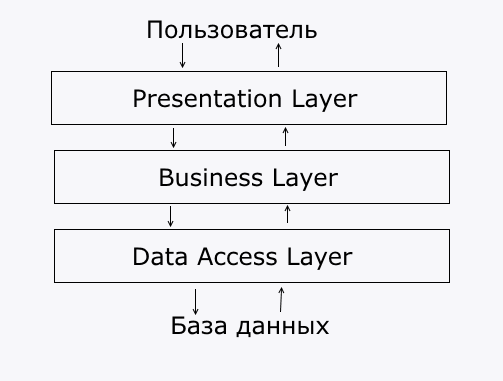

# Архитектура и Жизнь

## Виды типовых архитектур

В Enterprise разработке есть несколько видов архитектур, которые могут пересекаться. Например, монолит + трехслойная 
архитектура.

* По размеру сервисов:
    * **Монолитная архитектура**. Все приложение выполнено в одном большом сервисе.
        
        ??? "Плюсы и минусы"
            *Плюсы:* 
            
            * Нет накладных расходов на взаимодействие между модулями системы, так как все происходит в памяти в
            рамках одной jvm. 
            * Имеет более простой дизайн (не надо писать код для взаимосвязи сервисов) 
            * Не требует сложной инфраструктуры для запуска и эксплутации (на практике для больших монолитов все сложнее)  
            * Самый простой вариант
            
            *Минусы:*
            
            * Не может адекватно горизонтально масштабироваться, следовательно, не держит больших нагрузок, тем более 
            пиковых
            * Сложно масштабировать разработку, так как общая кодовая база. При большой команде разработчиков, они
            начинают мешать друг другу
            * Очень большое время бустрапа (долго запускается). При разработке и дебаге, это здорово бесит и снижает
            продуктивность
            * Чаще принимает вид огромного монстра, который жрет огромное количество ресурсов, требует для запуска целых
            ритуалов, работает не быстро, но 
            все боятся это трогать и просто докупают ресурсы для сервера, потому что так выходит дешевле, чем переписать
   
    * **Сервисная архитектура (SOA)**. Система состоит из нескольких сервисов, каждый из которых выполняют 
    свою задачу.
    
        ??? "Плюсы и минусы"
            *Плюсы:*
            
            * Умеет масштабироваться горизонтально, но до определенного предела.
            * Обладает простым и логичным дизайном
            * Просто писать, просто поддерживать
            * Не требует сложной инфраструктуры для запуска и эксплутации (хватает docker swarm)
            
            *Минусы:*
            
            * Большой (реально большой) нагрузки не держат (не **highload**)  
            * Часто требуются внешние системы для связи между сервисами (брокер очередей например), а это 
            дополнительные наклады расходы на поддержку, эксплутацию + дополнительная точка отказа
    
    * **Микросервисная архитектура**. Система состоит из множества маленьких (маленькие, это когда не влом написать
    заново) сервисов, который каждый выполняет  свою задачу.
    
        ??? "Плюсы и минусы"
            *Плюсы:*
            
            * Хорошо горизонтально масштабируются
            * Хорошо масштабируются в плане разработки, позволяют гораздо быстрее создать готовый продукт и быстрее
            его развивать
            * Сервисы очень маленькие, легко понять, а если не поняли, написать заново.     
            * Позволяет писать на целом зоопарке технологий, так как нет общей кодовой базы (или она маленькая) 
            
            *Минусы:* 
            
            * Сложность. Микросервисные системы очень сложные -- распредленные транзакции, *service-discovery*, 
            версионность протоколов и API не делают вашу жизнь проще.
            * Для работы такой системы требуется сложная инфраструктура, так как с большим догом гулять проще,
            чем с десятком чихуа-хуа.  Требуется много различных сторонних сервисов для организации взаимодействия
            между сервисами и их правильная настройка. 

* По внутренней структуре:
    * **Трехслойная архитектура**.
    
        
        
        Иногда ее называют тортик-архитектура. Принципы:
        
        * Приложение делится на 3 слоя
        * Каждый слой должен зависеть только от слоя на один уровень ниже (но только строго на один уровень ниже, т.е. 
        **Presentation Layer** (servlet) зависит от **Business Layer**, но ничего знает про **Data Access Layer** (repository)).
        * Каждый слой ничего не должен знать про слои выше.
        
        Виды слоев: 
        
        * **Presentation Layer** -- слой для взаимодействия с пользователем. Данный слой ответственнен прием и отдачу данных,
        их преобразование в термины вашей системы. Например, пользователь присылает вам запрос с json-сообщением, а слой 
        представления должен преобразовать этот запрос в объект `Task`. И наоборот, данный слой конвертирует сущности вашей
        системы в формат, удобный для пользователя (тот же самый json, html страничка и так далее.). 
        
            ???+ danger "Важно"
                Слой представления не должен содержать в себе логики. Он отвечает только за конвертацию входных данных в термины
                вашей системы и наоборот. Любая логика запрещена. Это правило следует из принципа Единой ответственности.
        
        * **Business Layer** -- слой бизнес-логики. Самый главный слой вашей системы. Инкапсулирует логику работы приложения. 
        
        * **Data Access Layer** -- слой взаимодействия с хранилищем данных. Хранилищем данных может выступать не только СУБД,
        но и веб-сервисы, файлы. В этом слое реализованы атомарными операции с данными (CRUD). Если на Data Access Layer вам
        хочется сделать в одном методе несколько вызовов к бд, это означает, что вашему коду место на слой выше.         
    
    * **Не трехслойная**. Здесь все просто, либо она трехслойная, либо какая-то другая (зависит уже от приложения)        

## Виды технических систем

На практике встречаются чаще всего два типа систем:

* **CRUD + бизнес-логика**. Приложения для манипуляции бизнес-сущностями. 

    Например, у нас есть студия фитнеса. К нам приходит новый клиент (**C**RUD операции) и записывается на тренировку
    (**бизнес-логика**, то есть реализация какого-то реального бизнес-процесса).
    
    Такие приложения строятся по трехслойной монолитной архитектуре, реже - микросервисной. Сервисная архитектура 
    представлена как *Монолит* + вспомогательнные сервисы (отправка почты или типа того)
    
* **Pipeline обработки данных**. Системы для обработки данных. Выглядит как граф последовательных обработчиков данных.
    
    Типовая структура: **источники данных** -> **цепочка обработчиков** -> **потребители данных**.
    
    Легко отличить от *CRUD-скуки* тем, что источники данных и потребители данных это разные объекты. 
    
* Нестандартные вещи, например, [**CQRS + ES**](https://habr.com/ru/post/146429/)    

По большему счету системы делятся на две большие группы: 

* **Структура данных первична**. Системы, где структура хранимых и обрабатываемых данных важнее, чем способы их
обработки. Сюда относятся все системы, имеющие сложные реляционные структуры (Издательство - Автор - Книга - 
Список книг - Читатель). Проектируется в первую очередь реляционная модель данных, а уже потом бизнес-логика.

* **Структура логики обработки данных первична**. Системы, где логика обработки данных важнее, чем структура данных,
которые обрабатываются. Структуры данных между собой часто не связаны совсем, либо граф зависимостей минимален. 
Проектируется в первую очередь граф обработки данных.     

## Реляционная модель

## Не придумал текст

* **Отказоустойчивость** (**fault tolerance**) -- свойство системы, позволяющее в случае неработоспособности отдельного 
элемента или функции приложения не выводить из строя само приложение. Другими словами, устойчивость программы к отказам.
 
* **Доступность** -- свойство системы, позволяющее быть защищенной и легко восстановливаемой от простоев в короткое
время и автоматизированными средствами
