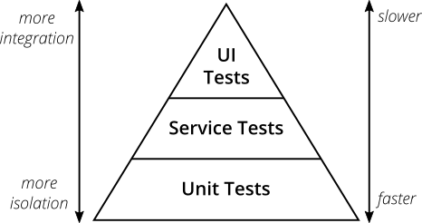
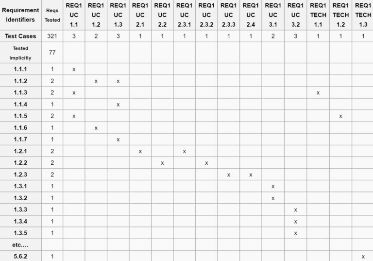

# Кратко о QA

## Жизненный цикл ПО

Жизненным циклом программного обеспечения (SLC) является период времени, начинающийся с момента появления концепции ПО 
и заканчивающийся тогда, когда использование ПО более невозможно.

Жизненный цикл программного обеспечения обычно включает в себя следующие этапы: 

1. Принятия решения (идея) о необходимости создания ПО;
2. Сбор и анализ требований;
3. Дизайн (Системы и ПО) на основе требований;
4. Кодирование на основе дизайна системы;
5. Тестирование;
6. Внедрение в пользовательскую среду;
7. Сопровождение (в том числе фиксация найденных в пользовательской среде ошибок);
8. Изъятие из эксплуатации (редко);

## Quality Assurance (QA) или немного о тестировании

Существует 3 термина, которые легко перепутать: тестирование (Testing), контроль качества (QC – Quality Control) 
и обеспечение качества (QA — Quality Assurance). Все они связаны друг c другом: QA – самое широкое понятие, оно включает 
в себя QC, в которое входит тестирование.

1. **Обеспечение качества (QA)** отвечает за весь процесс разработки, поэтому должно быть интегрировано во все этапы 
разработки: от описания проекта до тестирования, релиза и даже пост-релизного обслуживания. 
Специалисты QA создают и реализуют различные тактики для повышения качества на всех стадиях производства: 
подготовка и установление стандартов, анализ качества, выбор инструментов, предотвращение появления ошибок и 
постоянное усовершенствование процесса.

2. Задача **Контроля качества (QC)** — гарантировать соответствие требованиям (поиск ошибок и их устранение).
 QC ориентирован на проверку продукта, включает в себя многие процессы, такие как анализ кода, технические обзоры, 
 анализ дизайна, тестирование и пр.
 
3. **Тестирование** — это проверка результатов работы на соответствие требованиям.

## Пирамида тестирования

* **Unit тесты** — тестирование отдельного модуля ПО (в Java модулем является класс). Проверяется только сам модуль,
всего его зависимости заменяются на заглушки. Данный тип тесты должны писать разработчики.
* **Service/Integration/API тесты** — интеграционные тесты. Проверяется группа модулей, их взаимодействие. Могут писать 
как разработчики, так и автоматизаторы из QA
* **UI тесты** — тестирование пользовательского интерфейса. Разрабатываются только автоматизаторами из QA.
* **Ручное тестирование** — обычно тестирование пользовательского интерфейса руками. Дешево и сердито. 

## Инструменты тестирования (в контексте Java)

Звездочкой обозначены обязательные знания по данному инструменты

* **Unit тестирование**:
    * **Junit 4*** — самый распространненый фреймворк для тестирования. Есть абсолютно везде.  
    * **Junit 5** — свежеая версия предудыщего фреймворка, но пока встречается реже
    * **Spock** — редкий инструмент для **BDD** (**Behavior-driven development**) тестирования на языке Groovy.
    * **Mockito*** — вспомогательная библиотека, позволяющая изолировать модуль от зависимостей.
    * **PowerMock** — более мощная версия предыдущей библиотеки
    * **TestNG** — аналог для **Junit**, но не так популярен
* **Integration/API тестирование**:
   * **REST Assured*** — библиотека для тестирования API
   * **Cucumber*** — самый популярный фреймворк для написания интеграционных тестов. Есть для многих языков
   * **Gauge** — тоже самое, но с небольшими отличиями 
* **UI тестирование**
    * **Selenium*** — инструмент, который позволяет эмулировать браузеры и взаимодействие пользователя и UI. 

## Матрица соответствия требований (Requirements Traceability Matrix)          

Это двумерная таблица, содержащая соответствие функциональных требований (**functional requirements**) продукта и 
подготовленных тестовых сценариев (**test cases**). В заголовках колонок таблицы расположены требования, 
а в заголовках строк — тестовые сценарии. На пересечении — отметка, означающая, что требование текущей колонки 
покрыто тестовым сценарием текущей строки. Матрица обычно хранится в виде электронной таблицы.
 
**Матрица соответствия требований** используется **QA**-инженерами для валидации покрытия требований по продукту
 тестами. Цель «Traceability Matrix» состоит в том, чтобы выяснить:
* какие требования «покрыты» тестами, а какие нет.
* избыточность тестов (одно функциональное требование покрыто большим количеством тестов).

