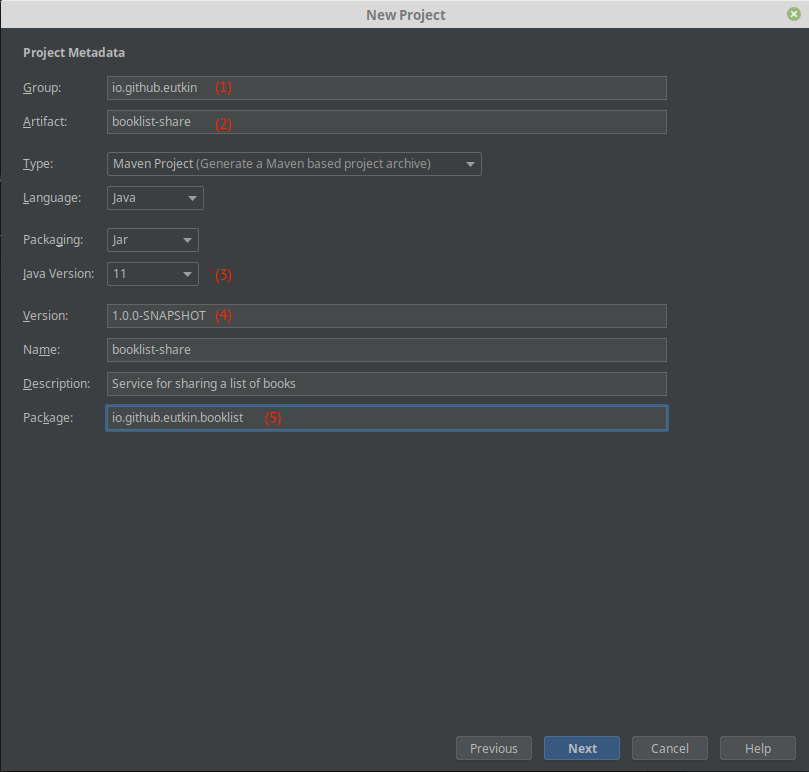
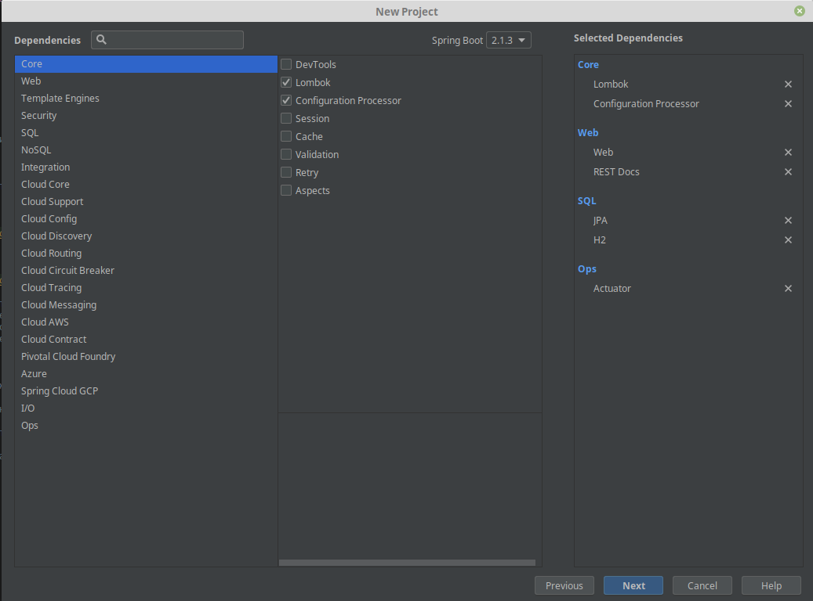
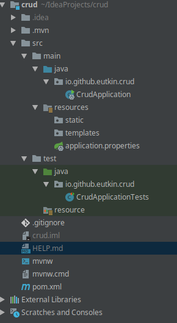
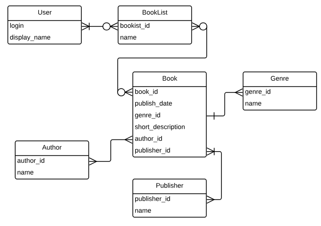

# CRUD приложение на Spring Boot 2

[Проект](https://github.com/eutkin/crud)

## Требования к окружению

* git
* Intellij Idea Ultimate (мы же не простые ребята)
* Плагины для идеи:
    
    * .ignore
    
    * lombok plugin
    
* maven (можно встроенный в идею)

## Инициализация проекта

Проект можно проинициализовать либо на [сайте](https://start.spring.io/), либо через ultimate idea.

Выбираем `New Project`:


Далее:



1. GroupId -- ваш идентификатор как автора. Если не знаете, что писать, пишите 
io.github.<ваш ник на гитхабе в нижнем регистре>
2. ArtifactId -- название проекта. Пишется в нижнем регистре, слова разделяются `-`
3. Версия Java. В большинстве компаний используется 8 версия, но 11 уже стабильна и для новых проектов можно 
использовать ее
4. Версия. Версия состоит из 4 частей: 
    
    * **1**.0.0-SNAPSHOT. Мажорная версия. Инкрементируется при масштабных изменениях, при сильных изменениях в API.
    
    * 1.**0**.0-SNAPSHOT. Минорная версия. Инкрементируется при добавлении новой фичи
    
    * 1.0.**0**-SNAPSHOT. Патч. Инкрементируется при исправлении бага
    
    * 1.0.0**-SNAPSHOT**. Квалифер. Альфа, бета, снапшот и так далее

5. Рут пакет.

Следующий шаг помогает выбрать зависимости:

    
      
Рекомендуется набор зависимостей, как на скриншоте.

* **Lombok** -- кодогенератор 
* **Configuration Processor** -- позволяет интегрировать ваши конфигурационные параметры в мета файл конфигурации 
спринга. На практике эта информация нужна IDE, чтобы работало автодополнение и так далее.
* **Web** -- и так все понятно
* **REST Docs** -- документация к апи (swagger)
* **JPA** -- ORM (hibernate)
* **H2** -- встраиваемая бд, идеальный вариант для разработки
* **Actuator** -- предоставляет API, с помощью которого можно мониторить приложение
* **Security** -- модуль для авторизаций и всего такого. 

P.S.

Я забыл добавить Security на скрине, но переделывать мне лень. Поэтому добавьте сами в pom.xml в dependencies:
```xml
 <dependency>        
    <groupId>org.springframework.boot</groupId>           
    <artifactId>spring-boot-starter-security</artifactId>           
</dependency>
```
       
                
Получаем проинициализированный проект:



* **.mvn** -- здесь лежит встроенный мавен. Используется при настройке [CI](https://habr.com/ru/post/352282/).
* **src**
    
    * **main**
    
        * **java**  -- исходники
        
        * **resources** -- ресурсы. Конфиги и все то, что окажется в classpath
            
            * **static** -- используется только в веб. В папке лежат статические ресурсы, js, css, etc
            
            * **templates** -- используется только в веб. Лежат шаблоны для шаблонизаторов.

    * **test** -- папка с тестами
        
        * **java** -- исходники тестов
        
        * **resources** -- уже было, но только для тестов
        
* **.gitignore** -- специальный файл-конфиг, который позволяет не пихать в гитхаб лишнего
* **mvnw|mvnw.cmd** -- так называет мавен wrapper. Позволяет использовать мавен из папки .mvn. 
* **pom.xml** -- описание сборки для мавена

## DDL скрипт

Вспомним нашу ER-диаграмму:

                    
               
И напишем ddl скрипт, который будет задавать структуру базы данных. Используем синтаксис postgres'a, так как
в бою будет он. Чтобы H2 мог разобрать с диалектом postgres'a, добавляем в url параметр `MODE=PostgreSQL`.

Модифицируем `application-dev.properties`:

```properties
# показываем генерируемый хибернейтом sql
spring.jpa.show-sql=true\
   
# включаем h2 консоль, что можно было посмотреть содержимое бд
spring.h2.console.enabled=true

# отключаем автогенерацию схемы по entity, так как схему будем создавать через sql
spring.jpa.hibernate.ddl-auto=none

# Нужно добавить MODE=PostgreSQL. Нормальный способов нет, поэтому пишем всю строку подключения и 
# и добавляем параметр туда
spring.datasource.url=jdbc:h2:mem:%s;DB_CLOSE_DELAY=-1;DB_CLOSE_ON_EXIT=false;MODE=PostgreSQL

# отключаем пока security
spring.autoconfigure.exclude=org.springframework.boot.autoconfigure.security.servlet.SecurityAutoConfiguration
```

Добавляем в ресурсы файл `schema.sql`, содержащий следующий ddl скрипт

```postgresql
create table authors (
  author_id bigint       not null,
  name      varchar(255) not null,
  primary key (author_id)
);
create table genres (
  genre_id bigint not null,
  genre    varchar(255),
  primary key (genre_id)
);

create table publishers (
  publisher_id   bigint       not null,
  publisher_name varchar(255) not null,
  primary key (publisher_id)
);

create table books (
  book_id           UUID        not null,
  publish_date      date,
  short_description varchar(1000) not null,
  genre_id          bigint references genres(genre_id),
  publisher_id      bigint references publishers(publisher_id),
  primary key (book_id)
);

create table users (
  login        varchar(255) not null,
  display_name varchar(255),
  password     varchar(255),
  primary key (login)
);

create table booklists (
  booklist_id UUID not null,
  name        varchar(255),
  author      varchar(255) references users(login),
  primary key (booklist_id)
);

create table booklists_books (
  booklist_id binary not null references booklists(booklist_id),
  book_id     binary not null references books(book_id),
  primary key (booklist_id, book_id)
);

create table booklists_users (
  booklist_id UUID       not null references booklists(booklist_id),
  login       varchar(255) not null references users(login),
  primary key (booklist_id, login)
);

create table books_authors (
  book_id   UUID not null references books(book_id),
  author_id UUID not null references authors(author_id),
  primary key (book_id, author_id)
);
```           

## Создание моделей

Модели можно сгенерировать либо по таблицам в базе (способ поищите сами, их много), либо написать руками.

Код моделей можете посмотреть на гитхабе, на примере разберем только несколько.

Пользователь: 

```java
@Entity
@Table(name = "users")
public class User implements UserDetails { // А вот это интерфейс Spring Security, 
    // маркер того, что класс хранит  информацию о пользователе

    @Id
    private String login;

    // На самом деле здесь не хранятся пароли. Здесь хранится его хэш.
    // Это необходимо для того, чтобы не хранить пароли в базе в открытом виде.
    // Работает это довольно просто. Нам извне приходит пароль (при логине пользователя)
    // Внешний пароль мы хэшируем и проверяем, совпадает ли он с хэшом из базы. 
    // Так как для одинаковых паролей хэш будет одинаков, то все ок
    private String password;

    private String displayName;

    @ManyToMany(cascade = ALL, mappedBy = "users", fetch = EAGER)
    private Set<Booklist> booklists = new HashSet<>();

    // Здесь хранятся роли пользователя, админ там, секретарша или типа того
    // Но у нас будет только одна роль, поэтому в базе мы ее не храним и забиваем 
    // гвоздями. Не забудь только про ROLE_, без него не будет работать. 
    @Override
    public Collection<? extends GrantedAuthority> getAuthorities() {
        return Collections.singleton(new SimpleGrantedAuthority("ROLE_USER"));
    }

    @Override
    public String getPassword() {
        return password;
    }

    @Override
    public String getUsername() {
        return login;
    }

    // Ниже идет всякая фигня, если мы как-то хотим забанить пользователя
    @Override
    public boolean isAccountNonExpired() {
        return true;
    }

    @Override
    public boolean isAccountNonLocked() {
        return true;
    }

    @Override
    public boolean isCredentialsNonExpired() {
        return true;
    }

    @Override
    public boolean isEnabled() {
        return true;
    }

    public User addBooklist(Booklist booklist) {
        booklists.add(booklist);
        return this;
    }

    @Override
    public boolean equals(Object o) {
        if (this == o) return true;
        if (o == null || getClass() != o.getClass()) return false;
        User user = (User) o;
        return Objects.equals(login, user.login);
    }
    
    @Override
    public int hashCode() {
        return Objects.hash(login);
    }
    
    // Геттеры & Сеттеры
}    
``` 

Список книг:

```java
@Entity  // Обязательная аннотация-маркер, что dto является сущностью
@Table(name = "booklists") // аннотация для указания имени таблицы и схемы
public class Booklist {

    @Id //обязательная аннотация для поля-первичного ключа
    @GeneratedValue(generator = "uuid")
    @GenericGenerator(name = "uuid", strategy = "uuid") //генерирует uuid автоматически 
                                                        // при сохранении в бд
    @Column(name = "booklist_id") //аннотация для указания 
                                  // параметров маппинга и генерации схемы
    private UUID id;

    // не является обязательной, имя поля по умолчанию выступает как имя столбца
    private String name;

    @ManyToOne // аннотация для связи Много-к-Одному. 
               // У нескольких буклистов может быть только один автор
    @JoinColumn(name = "author") // имя стоблца, по которому можно сделать 
                                // join для получения информации об авторе
    private User author;

    @ManyToMany // связь много-ко многим
    // здесь указывается колонки в таблице
    @JoinTable(name = "booklists_users",
        joinColumns = @JoinColumn(name = "booklist_id"), 
        inverseJoinColumns = @JoinColumn(name = "login"))
    private Set<User> users;

    @ManyToMany
    @JoinTable(name = "booklists_books", 
        joinColumns = @JoinColumn(name = "booklist_id"), 
        inverseJoinColumns = @JoinColumn(name = "book_id"))
    private Set<Book> books;
    
    // Геттеры & Сеттеры

}
``` 

Надо еще бы указать `equals` и `hashCode`, но сделаем это позже.

???+ "Немного про lombok"
    Многие любят использовать lombok при написания моделей. Я этого делать не советую по некоторым причинам:
    
    * В сущностях и так слишком много аннотаций. Серьезно, только над самим классом уже две. А хотелось бы добавить
    `@Data`, `@Accessor(chain = true)` (позволяет сеттить значения полей более удобно). Но в итоге весь класс
    оказывается увешан аннотациями так, что даже кода под ним не видно.
    * С аннотацией `@Data` тоже не все однозначно. Допустим у нам обычная bi-direction связь, например, книга
    ссылается на издателя, а издатель на свои книги. Если мы повесим эту аннотацию на класс книги и издателя, то после
    вызова equals & hashcode приложение уйдет в бесконечный цикл. Это происходит, потому что equals & hashcode 
    генерируются для всех полей. То есть у издателя тоже будет вызван метод equals & hashcode, так как он является
    полем книги, а в нем  есть поле с книгами, у которых этим методы тоже будут вызваны и так до бесконечности.
    Чтобы этого избежать, можно повесить аннотацию `@EqualsAndHashCode(exclude = {"books"}`, а это опять + 1
    аннотация. 
    
    Исходя из озвученных причин я советую избегать использования lombok'a в сущностях


## Прикручиваем Spring Security

Если подключить зависимость 

```xml
 <dependency>        
    <groupId>org.springframework.boot</groupId>           
    <artifactId>spring-boot-starter-security</artifactId>           
</dependency>
```

то Spring позаботится о защищенности вашего предложения и создаст конфигурацию по умолчанию с пользователем `User`
и случайно сгенерированным паролем. 

Чтобы настроить Spring Security по-человечески надо уже писать собственную конфигурацию. Часть работы мы уже сделали,
создали собственную модельку для пользователя. Теперь настроим все по красоте:

```java
@Configuration
@Profile("dev") // конфиг будет работать, только если приложение запустить 
// под профилем "dev", потому что мы здесь отключим некоторые политики 
// безопасности, чтобы была возможность проверить
// работу приложения, пощупать руками, так сказать
@EnableWebSecurity // аннотация, чтобы включить security и наследуемся 
                   // от адаптера-конфигуратора
public class SecurityConfiguration extends WebSecurityConfigurerAdapter {

    // Это интерфейс модуля, задача которого вытащить пользователя из хранилища
    // В нашем случае, вытащить из базы. Мы сейчас доделаем конфиг 
    // и напишем ему реализацию
    private UserDetailsService userRepository;

    // Это бин, который хэширует пароли. Для чего это нужно, я писал выше
    @Bean
    public PasswordEncoder bcrypt() {
        return new BCryptPasswordEncoder();
    }

    // Здесь конфигурируем менеджера аутентификацим
    @Override
    protected void configure(AuthenticationManagerBuilder auth) {
        auth.userDetailsService(userRepository).passwordEncoder(bcrypt());
    }

    // Здесь производится основная настройка
    @Override
    protected void configure(HttpSecurity http) {
        http
        // включаем basic auth. Это самый простой способ, 
        // но для его использования 
        // рекомендуется иметь https
        .httpBasic()
        .and()
        // Мы же пишем REST, а ему сессия не нужна. Отключаем ее создание
        .sessionManagement().sessionCreationPolicy(STATELESS)
        .and()
        // Сross Site Request Forgery - техника подмены запроса между сайтами
        // Я рак, я ей пользоваться не умею. Если ваш сервис использует 
        // шаблонизатор и вы возвращаете или
        // получаете запросы с html страничек, то отключать его не надо. 
        // В том числе и на проде.
        // А если вы через Postman хотите потыкать в свое API, 
        // то можете отключать
        .csrf().disable()
        // Отключаем заголовок, который контроллирует наличие https, 
        // так как у нас его нет и заголовок
        // в Postman мне ставить лень
        // Конечно, отключать это не следует, но пока идет разработка, 
        // то лучше отключить,
        // иначе сервис будет плеваться 403 статусами и не давать работать
        .headers().httpStrictTransportSecurity().disable()
        .and()
        .authorizeRequests()
        // контроллирует, что для работы с API нужно авторизоваться 
        // под ролью USER
        .antMatchers("/api/**").hasRole("USER")
        ;
    }

    // У нас есть h2 консоль для дебага, давайте отключим там security вообще
    @Override
    public void configure(WebSecurity web) throws Exception {
        web.ignoring().antMatchers("/h2-console/**");
    }


    @Autowired
    public void setUserRepository(UserDetailsService userRepository) {
        this.userRepository = requireNonNull(userRepository);
    }
}
```   

Наша конфигурация требует `UserDetailsService`, напишем реализацию поверх репозитория Spring Data Jpa:

```java
public interface UserRepository 
                extends UserDetailsService, JpaRepository<User, String> {

    @Override
    default UserDetails loadUserByUsername(String username) 
                    throws UsernameNotFoundException {
        
        return findById(username)
                    .orElseThrow(() -> new UsernameNotFoundException(username));
    }
}
```

Все, мы закончили.

## Бизнес-логика и всё остальное

Весь остальной код мы будем писать по мере надобности.

Мы анализировали бизнес-логику задачи в [этом разделе](a1.md#-).

Реализуем пока только следующие операции:

* **Создание буклиста**

    Пользователь посылает команду в приложение для создания буклиста. Команда содержит имя буклиста. Опционально,
    команда может содержать **множество** (множество в отличие от списка хранит только уникальные значения)
     id книг, которые добавляются в буклист. Приложение должно вернуть уникальный
    идентификатор созданной сущности (буклиста в данном случае), либо описание ошибки.      

* **Добавление книги в существующий буклист**
    
    Пользователь посылает команду в приложение добавлении книгу в буклист. Команда содержит идентификатор буклиста,
    множество идентификаторов добавляемых книг. Приложение возвращает обновленный буклист, либо описание ошибки.


### Способы реализации ввода-вывода или нужно ли плодить модели?

Обычная трехслойка, есть контроллер, сервис и репозиторий. Слои обмениваются данными между собой и здесь все не так 
однозначно. Есть несколько способов:

* Вы просто обмениваетесь entity'ями между слоями. Вешаете на них валидацию, забиваете на факт того, что все 3 слоя
от них зависят, просто и со вкусом.
    
    Плюсы:
        
    * Не надо писать лишних моделек
    
    * Не надо писать конвертеры из одних моделей в другие
        
    Минусы:
    
    * Когда надо отдать данные, не укладывающиеся в структуру существующих моделей у вас будут проблемки 
    * Если добавлять аннотации на валидацию, то количество аннотаций достигнет критической отметки
    
* Вы пилите отдельные модели для команд от пользователя и для представления (view). Плюсы и минусы описаны выше, 
только наоборот.            
        
Первый способ подходит для маленьких сервисов, которые проще переписать с 0, чем менять полпроекта,
второй -- для монолитов и сервисов побольше.

Мы выбираем второй путь.       

### Алгоритм написания бизнес-логики и около того

Алгоритм написания бизнес-логики и около того довольно прост.

1. Пишем модельку для команды (пакет `io.github.eutkin.crud.request`). 
Модель должна содержать данные, которые приходят извне и необходимые для совершения операции

2. Пишем модельку для отображения данных в пакет `io.github.eutkin.crud.view`. Модель содержит информацию,
которую мы хотим вернуть пользователю.

3. Пишем конвертеры из команды в сущность и из сущности и представление
4. Пишем интерфейс и реализацию сервиса с бизнес логикой:

    а. Конвертируем команду в сущность. 
    б. Манипулируем сущностями.
    в. Конвертируем в представление

5. Если понадобится, пишем репозитории, но стараемся обходится без них (спасибо каскадным операциям)

6. Пишем фасад, который объединит наши сервисы с бизнес логикой (чтобы в клиентский код не пришлось инжектить кучу
сервисов)

6. Пишем контроллер для операции. 

Примеры реализации не забываем смотреть на [гите]((https://github.com/eutkin/crud)) (вы же скачали себе проект, да?)

    


     